# Multiple Timeseries Forecasting

# Dataset

In this tutorial, we will train and evaluate multiple time-series forecasting models using the [Store Item Demand Forecasting Challenge dataset from Kaggle](https://www.kaggle.com/competitions/demand-forecasting-kernels-only/data?select=train.csv). This dataset has 10 different stores and each store has 50 items, i.e. total of 500 daily level time series data for five years (2013–2017).

# Download data

* Download the train.csv from https://www.kaggle.com/competitions/demand-forecasting-kernels-only/data?select=train.csv.
* Create a `./data` directory inside the directory of this Python notebook
* Save the train.csv inside the `./data` directory


<div>
<style scoped>
    .dataframe tbody tr th:only-of-type {
        vertical-align: middle;
    }

    .dataframe tbody tr th {
        vertical-align: top;
    }

    .dataframe thead th {
        text-align: right;
    }
</style>
<table border="1" class="dataframe">
  <thead>
    <tr style="text-align: right;">
      <th></th>
      <th>date</th>
      <th>store</th>
      <th>item</th>
      <th>sales</th>
    </tr>
  </thead>
  <tbody>
    <tr>
      <th>0</th>
      <td>2013-01-01</td>
      <td>1</td>
      <td>1</td>
      <td>13</td>
    </tr>
    <tr>
      <th>1</th>
      <td>2013-01-02</td>
      <td>1</td>
      <td>1</td>
      <td>11</td>
    </tr>
    <tr>
      <th>2</th>
      <td>2013-01-03</td>
      <td>1</td>
      <td>1</td>
      <td>14</td>
    </tr>
    <tr>
      <th>3</th>
      <td>2013-01-04</td>
      <td>1</td>
      <td>1</td>
      <td>13</td>
    </tr>
    <tr>
      <th>4</th>
      <td>2013-01-05</td>
      <td>1</td>
      <td>1</td>
      <td>10</td>
    </tr>
  </tbody>
</table>
</div>


    The dataset has 913000 rows and 4 columns


# Data fields

* date - Date of the sale data. There are no holiday effects or store closures.
* store - Store ID
* item - Item ID
* sales - Number of items sold at a particular store on a particular date.


# Plot total sales for all products over time

    
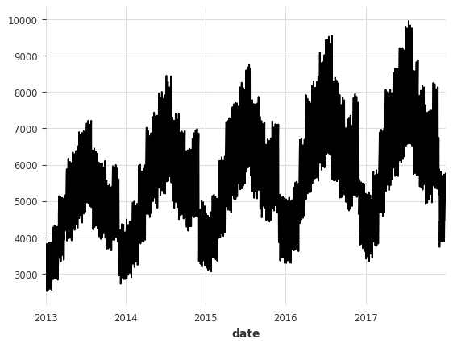
    


# Check for seasonality in the total number of 'sales' per 'date'

    
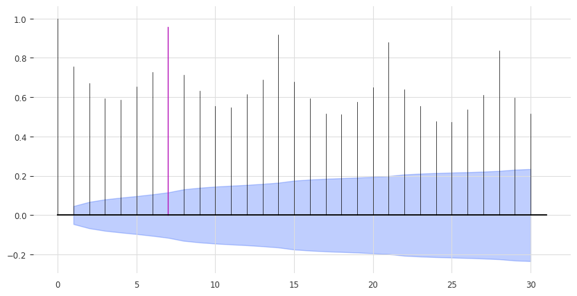
    


The ACF presents a spike at x in [1, 7, 14, 21], which suggests a weekly seasonality trend (highlighted). The blue zone determines the significance of the statistics for a confidence level of $\alpha = 5\%$. We can also run a statistical check of seasonality for each candidate period `m`.


## We will train multiple Statistical & ML models and evaluate which one performs best

# Create forecasts with Stats & Ml methods.

# Stats Methods with StatsForecast


```python
# Import necessary models from the statsforecast library
from statsforecast.models import (
    # SeasonalNaive: A model that uses the previous season's data as the forecast
    SeasonalNaive,
    # Naive: A simple model that uses the last observed value as the forecast
    Naive,
    # HistoricAverage: This model uses the average of all historical data as the forecast
    HistoricAverage,
    # CrostonOptimized: A model specifically designed for intermittent demand forecasting
    CrostonOptimized,
    # ADIDA: Adaptive combination of Intermittent Demand Approaches, a model designed for intermittent demand
    ADIDA,
    # IMAPA: Intermittent Multiplicative AutoRegressive Average, a model for intermittent series that incorporates autocorrelation
    IMAPA,
    # AutoETS: Automated Exponential Smoothing model that automatically selects the best Exponential Smoothing model based on AIC
    AutoETS
)
```


# ML Methods with MLForecast


```python
# Import the necessary models from various libraries

# LGBMRegressor: A gradient boosting framework that uses tree-based learning algorithms from the LightGBM library
from lightgbm import LGBMRegressor

# XGBRegressor: A gradient boosting regressor model from the XGBoost library
from xgboost import XGBRegressor

# LinearRegression: A simple linear regression model from the scikit-learn library
from sklearn.linear_model import LinearRegression
```


# Forecast Plots

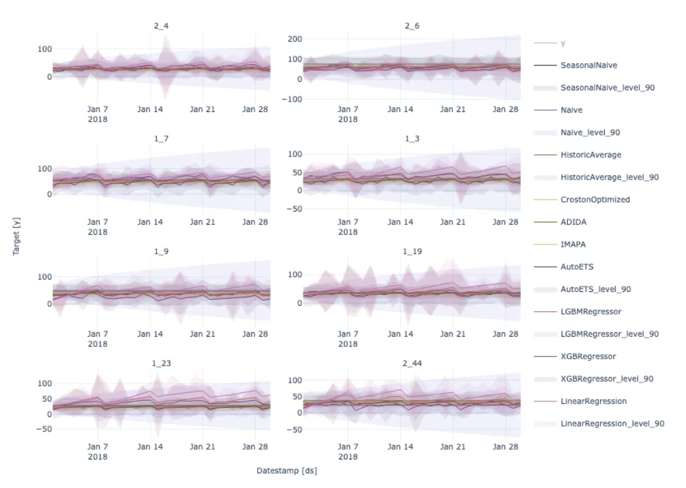

# Plot Cross Validation (CV)

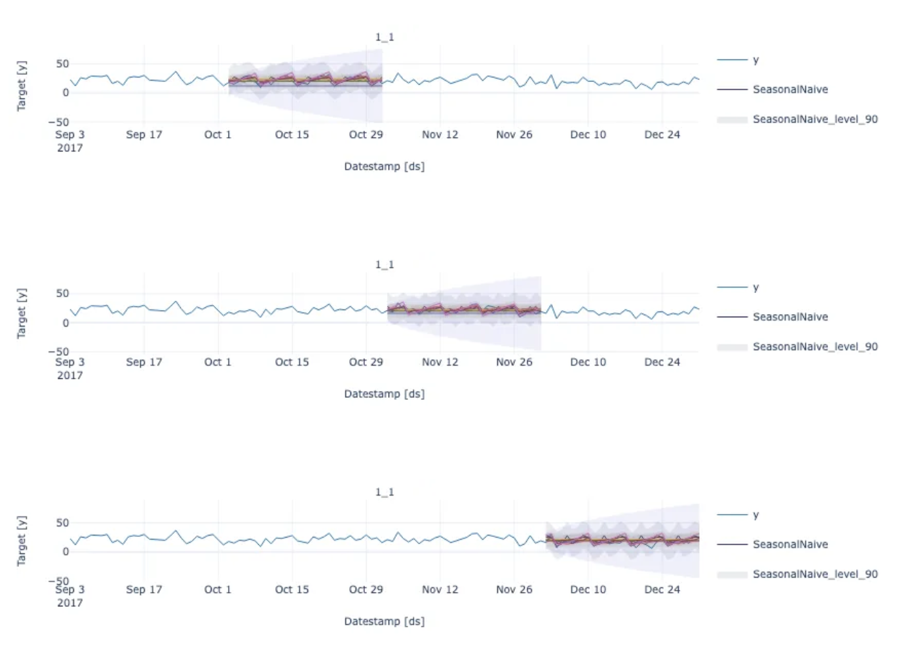


# Distribution of erros per model and evaluation metrics

    
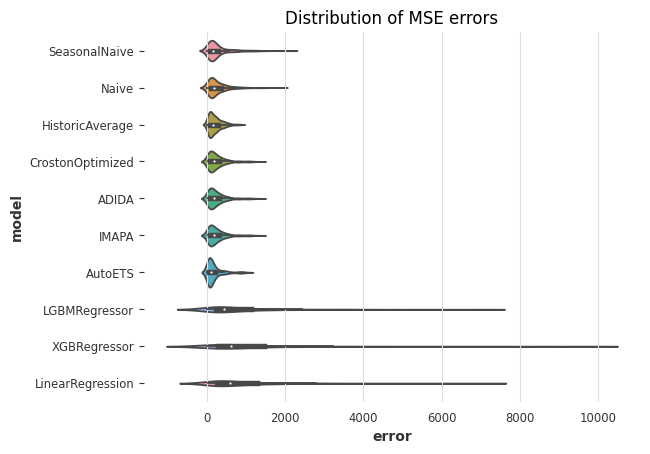
        

# In how many cross validation fold & metric is each model overperforming the rest?
    
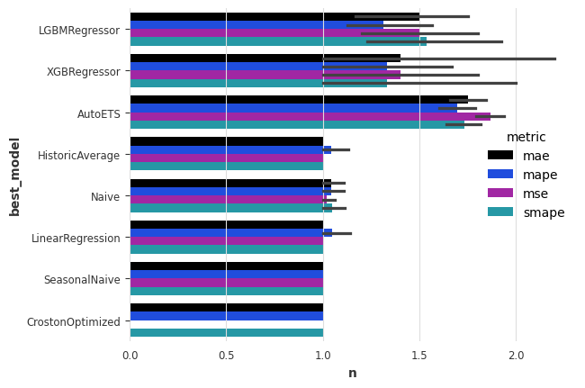
    

## AutoETS is the best performing model for all evaluation metrics

## This does not mean that AutoETS is the best performing model for each individual "store_item"

# What is the best model for store_item="1_1" sales forecasting?

    
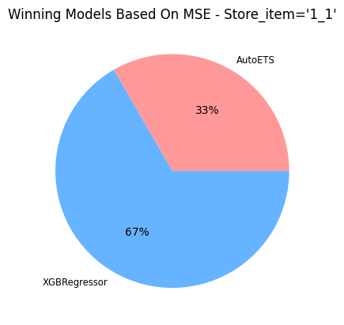    


XGBRegressor was the best performing model based on MSE for 2 out of the 3 validation folds of store_item 1_1.

    
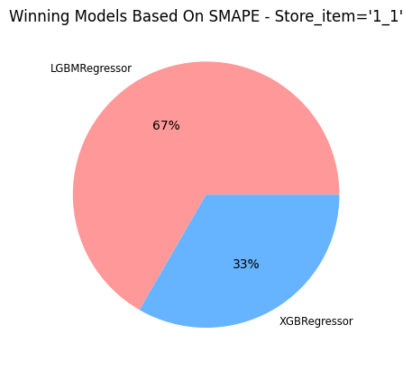
    


LGBMRegressor was the best performing model based on MSE for 2 out of the 3 validation folds of store_item 1_1.

# Visualize the forecasts (XGBRegressor & LGBMRegressor) of the best model for unique_id == "1_1"

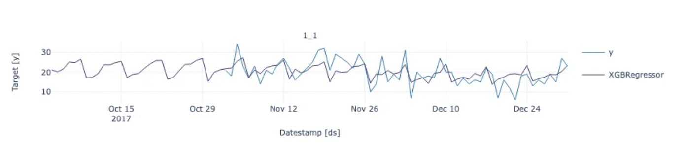
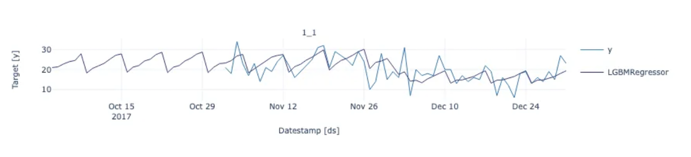


# Visualize the AutoETS forecasts for more unique_ids

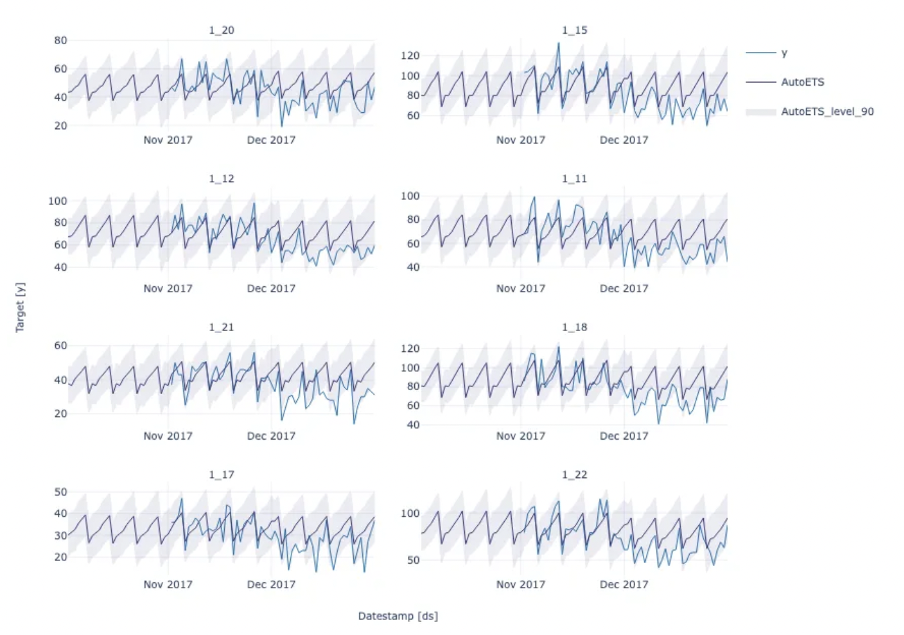


# Sources

This code is based on the following publicly available resources
* [Nixtla Statistical, Machine Learning and Neural Forecasting methods](https://nixtla.github.io/statsforecast/docs/tutorials/statisticalneuralmethods.html)
* [Intro to Forecasting with Darts](https://github.com/unit8co/darts/blob/master/examples/00-quickstart.ipynb)
* [Store Item Demand Forecasting Challenge dataset from Kaggle](https://www.kaggle.com/competitions/demand-forecasting-kernels-only/data?select=train.csv) 
